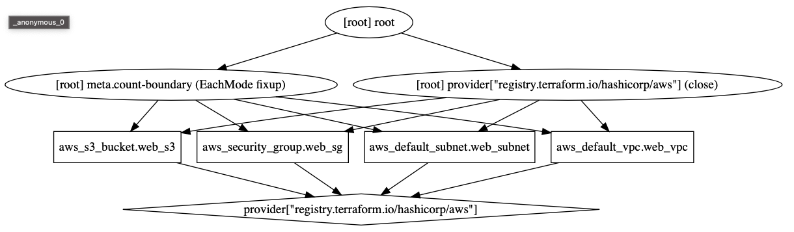

## Terraform Graph
### La commande **terraform grapp**
Avant d'appliquer le plan pour créer réellement l'infrastructure, on peut utiliser la commande Terraform graph pour générer une représentation visuelle de la configuration ou du plan d'exécution.

``` 
terrform graphp --help
``` 
``` 
Usage: terraform [global options] graph [options]

  Outputs the visual execution graph of Terraform resources according to
  either the current configuration or an execution plan.

  The graph is outputted in DOT format. The typical program that can
  read this format is GraphViz, but many web services are also available
  to read this format.

  The -type flag can be used to control the type of graph shown. Terraform
  creates different graphs for different operations. See the options below
  for the list of types supported. The default type is "plan" if a
  configuration is given, and "apply" if a plan file is passed as an
  argument.

Options:

  -plan=tfplan     Render graph using the specified plan file instead of the
                   configuration in the current directory.

  -draw-cycles     Highlight any cycles in the graph with colored edges.
                   This helps when diagnosing cycle errors.

  -type=plan       Type of graph to output. Can be: plan, plan-destroy, apply,
                   validate, input, refresh.

  -module-depth=n  (deprecated) In prior versions of Terraform, specified the
				   depth of modules to show in the output.
``` 
### Exemple d'utilisation
voici un fichier avec quelques ressources
``` 
cat maint.tf
``` 
``` 
provider "aws" {
  region  = "eu-west-3"
}

resource "aws_s3_bucket" "web_s3" {
  bucket = "s3-20201103"
}

resource "aws_default_vpc" "web_vpc" {
  tags = {
    Name = "Default VPC"
  }
}

resource "aws_default_subnet" "web_subnet" {
  availability_zone = "eu-west-3a"
}

resource "aws_security_group" "web_sg" {
  name        = "webserver"
  description = "Acces HTTP"
}
``` 
Exécution de la commande **terraform graph**
Elle fournit une sortie au format **dot**
```    
terraform graph
```    
```
digraph {
	compound = "true"
	newrank = "true"
	subgraph "root" {
		"[root] aws_default_subnet.web_subnet (expand)" [label = "aws_default_subnet.web_subnet", shape = "box"]
		"[root] aws_default_vpc.web_vpc (expand)" [label = "aws_default_vpc.web_vpc", shape = "box"]
		"[root] aws_s3_bucket.web_s3 (expand)" [label = "aws_s3_bucket.web_s3", shape = "box"]
		"[root] aws_security_group.web_sg (expand)" [label = "aws_security_group.web_sg", shape = "box"]
		"[root] provider[\"registry.terraform.io/hashicorp/aws\"]" [label = "provider[\"registry.terraform.io/hashicorp/aws\"]", shape = "diamond"]
		"[root] aws_default_subnet.web_subnet (expand)" -> "[root] provider[\"registry.terraform.io/hashicorp/aws\"]"
		"[root] aws_default_vpc.web_vpc (expand)" -> "[root] provider[\"registry.terraform.io/hashicorp/aws\"]"
		"[root] aws_s3_bucket.web_s3 (expand)" -> "[root] provider[\"registry.terraform.io/hashicorp/aws\"]"
		"[root] aws_security_group.web_sg (expand)" -> "[root] provider[\"registry.terraform.io/hashicorp/aws\"]"
		"[root] meta.count-boundary (EachMode fixup)" -> "[root] aws_default_subnet.web_subnet (expand)"
		"[root] meta.count-boundary (EachMode fixup)" -> "[root] aws_default_vpc.web_vpc (expand)"
		"[root] meta.count-boundary (EachMode fixup)" -> "[root] aws_s3_bucket.web_s3 (expand)"
		"[root] meta.count-boundary (EachMode fixup)" -> "[root] aws_security_group.web_sg (expand)"
		"[root] provider[\"registry.terraform.io/hashicorp/aws\"] (close)" -> "[root] aws_default_subnet.web_subnet (expand)"
		"[root] provider[\"registry.terraform.io/hashicorp/aws\"] (close)" -> "[root] aws_default_vpc.web_vpc (expand)"
		"[root] provider[\"registry.terraform.io/hashicorp/aws\"] (close)" -> "[root] aws_s3_bucket.web_s3 (expand)"
		"[root] provider[\"registry.terraform.io/hashicorp/aws\"] (close)" -> "[root] aws_security_group.web_sg (expand)"
		"[root] root" -> "[root] meta.count-boundary (EachMode fixup)"
		"[root] root" -> "[root] provider[\"registry.terraform.io/hashicorp/aws\"] (close)"
	}
}
```
faites un Copy/pAste sur le site [webGraphViz](http://www.webgraphviz.com)
on obtien ce type de graph 



###Graph en mode Local
Installer Graphiz
```
sudo apt install graphiz
```
Utiliser la commande **dot** pour générer un graphique
```
terraform graph | dot -T svg > graph.svg
```
### Blast Radius
```
pip install blastraduis
```
Démarrer le serveur 
```
blast-radius --serve .
```
